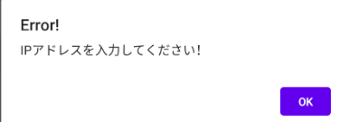
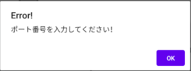
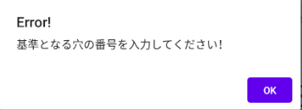
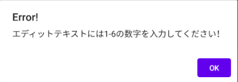
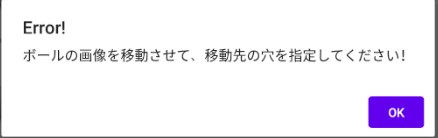
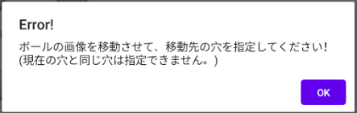

# 今回作成したAndroidアプリについて
　大学の授業の最終課題として、ロボット制御に関してこれまで作成したプログラムをベースにより高度なAndroidアプリを開発した。ここでは、そのAndroidアプリについて少し紹介する。
 
 まず最初に、作成したアプリのGUIレイアウトを以下の図に示し、各ボタンの機能について説明する。 
 
 
 
 * CONNECTボタン
      
      TCPクライアントタスクをバックグラウンドで生成し、入力されたIPアドレスとポート番号をもとにサーバとの接続を開始する。
  * DISCONNECTボタン
      
      生成されたバックグラウンドタスクを終了し、サーバとの接続を切断する。
  * SETボタン
      
      入力された基準となる穴の番号をもとに、ボールの画像をその穴の位置へ設置する。
  * RUNボタン
      
      サーバへメッセージを送信する。そして、サーバはそのメッセージをもとにロボットの制御を開始する。
  * CLEARボタン
      
      Logに表示されているテキストをすべて削除する。

 次に、各ボタンが押された時の例外処理を紹介する。
 * CONNECTボタン
      
      以下の図のように、IPアドレスやポート番号が入力されていない場合は警告ダイアログを表示する。
      
      
      
      
      
 * SETボタン
      
      以下の図のように、基準となる穴の番号が入力されていない場合や、入力された数字が範囲外の場合は警告ダイアログを表示する。
      
      
      
      
      
 * RUNボタン
      
      以下の図のように、移動先の穴が指定されていない場合や、基準となる穴と移動先の穴が同じだった場合は警告ダイアログを表示する。
      
      
      
      
      
 最後に、実際にAndroidアプリを使用してロボット制御のテストを行った動画を以下に示す。
 

https://user-images.githubusercontent.com/81803259/126119525-2d65a076-92ca-43b8-8fe7-f935199862c6.mp4

      
 
      
      
 
